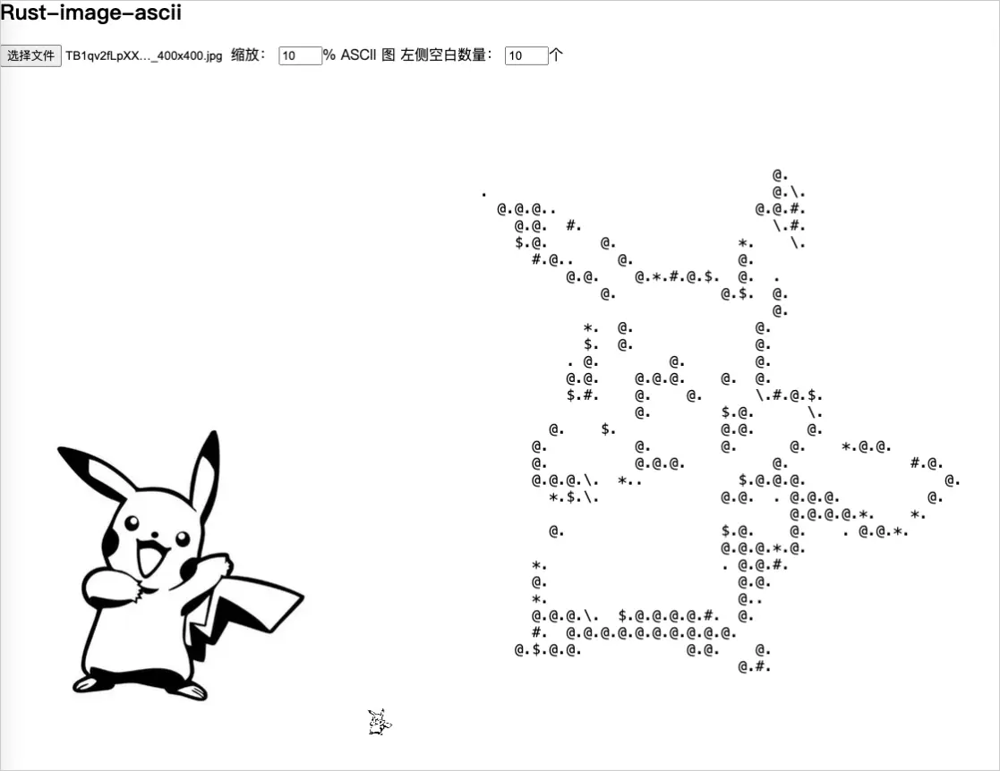

# Rust wasm image to ascii

```
██████████████████████████████████████████████████
████████████████████    ██████████████████████████
███████████████████   █  █████████████████████████
██████████████████  █████  ███████████████████████
█████████████████   █████    █████████████████████
████████████████   █████  █    ███████████████████
██████████████    █████  █  ██    ████████████████
████████████      ███  █  ██████   ███████████████
███████████  █    ██  █  ██████  █  ██████████████
██████████  ██    █  ██ █████   ███  █████████████
██████████          ███       ████     ███████████
█████████     █    █████      ███   █  ███████████
█████████  █   █  ██      ███  █      ████████████
██████████ ███    █  ███████   █     █████████████
████████     █    █  █       ██     ██████████████
███████    █   █  ███     ████     ███████████████
██████     ██ ███  ███████████   █████████████████
██████ █    █           ████      ████████████████
██████               ██            ███████████████
██████                       █████  ██████████████
█████                              ███████████████
██████ ███   █      心中有光        ████████████████
███████      █                  ██████████████████
███████████                     ██████████████████
███████████████               ████████████████████
███████████████                ███████████████████
███████████                     ██████████████████
█████████  ██                    █████████████████
████████                           ███████████████
████████          ███████      ██   ██████████████
███████          ██████████           ████████████
██████          █████████████         ████████████
████   ██      ███████████████      ██   █████████
███         ██████████████████████ █   ███████████
██████████████████████████████████████████████████
██████████████████████████████████████████████████
```

### 灰度算法

灰度算法对比：

[https://lecepin.github.io/rust-wasm-image-ascii/gray.html](https://lecepin.github.io/rust-wasm-image-ascii/gray.html)


这里直接使用的 `image` crate 的内置算法，上图中的第三种：

```rust
// luminance formula credits: https://stackoverflow.com/a/596243
// >>> Luminance = 0.2126*R + 0.7152*G + 0.0722*B <<<
// calculate RGB values to get luminance of the pixel
pub fn get_luminance(r: u8, g: u8, b: u8) -> f32 {
    let r = 0.2126 * (r as f32);
    let g = 0.7152 * (g as f32);
    let b = 0.0722 * (b as f32);
    r + g + b
}
```

### 简单版本

简单版本只做了一种效果，访问地址： [https://lecepin.github.io/rust-wasm-image-ascii/test.html](https://lecepin.github.io/rust-wasm-image-ascii/test.html)

